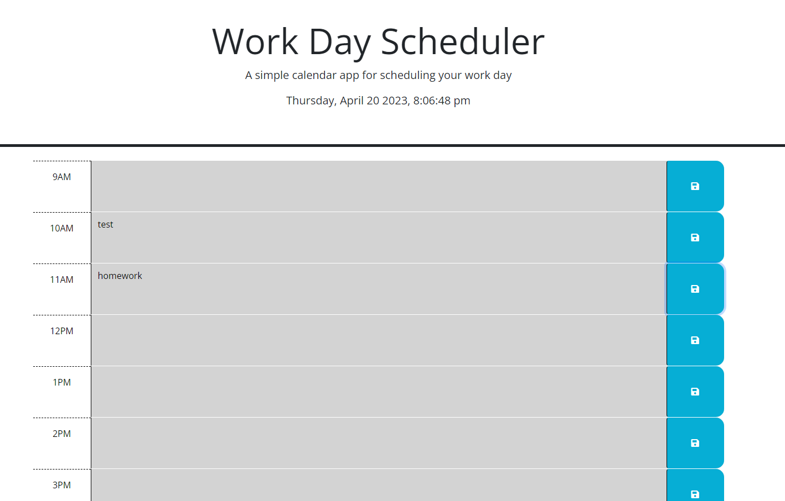

# Work-Day-Scheduler
### A Calendar with time slots you can save information to
#
#### By Patrick Lowe
#### A webpage hosting a Work day scheduler
#
## Technologies Used

### JavaScript
### HTML
### CSS
### Visual Studio Code
### GitBash
### Web-API's
### JQuery

#
## Description

#### We were asked to create a work day scheduler that was missing javascript 
#
## Getting Setup

#### You will take the second commit which give you all the starter code that was provided then follow the parameters below to complete the functionality:

#### GIVEN I am using a daily planner to create a schedule
#### WHEN I open the planner
#### THEN the current day is displayed at the top of the calendar
#### WHEN I scroll down
#### THEN I am presented with timeblocks for standard business hours
#### WHEN I view the timeblocks for that day
#### THEN each timeblock is color coded to indicate whether it is in the past, present, or future
#### WHEN I click into a timeblock
#### THEN I can enter an event
#### WHEN I click the save button for that timeblock
#### THEN the text for that event is saved in local storage
#### WHEN I refresh the page
#### THEN the saved events persist

## Screenshot of Website 

## References 

#### https://stackoverflow.com/questions/12200277/find-parent-element-in-jquery-event
#### https://stackoverflow.com/questions/9948171/parent-vs-parentnode
#### https://stackoverflow.com/questions/1133770/how-to-convert-a-string-to-an-integer-in-javascript%20%20%20
#### https://stackoverflow.com/questions/3138564/looping-through-localstorage-in-html5-and-javascript%20%20%20
#### https://stackoverflow.com/questions/415602/set-value-of-textarea-in-jquery
#### https://stackoverflow.com/questions/10507294/how-to-get-the-value-of-a-textarea-in-jquery
#### https://stackoverflow.com/questions/1474089/how-to-select-a-single-child-element-using-jquery

## Link to the deployed website 

### https://patrickwlowe.github.io/Work-Day-Scheduler/
